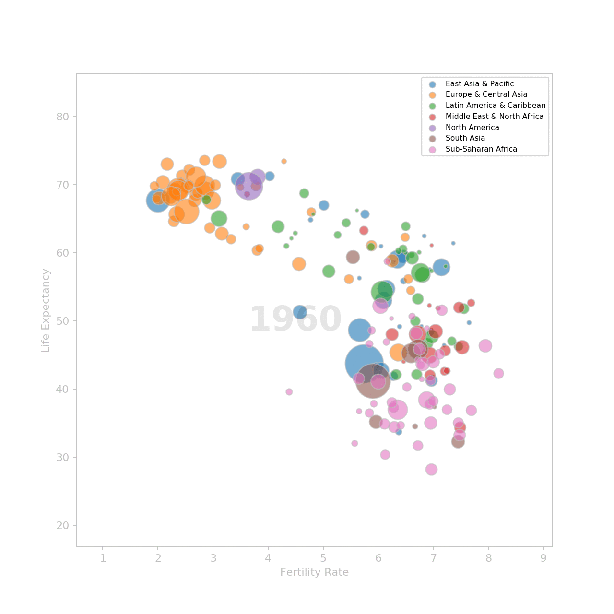

# best_stats_ever

In a TED talk titled *"The best stats you've ever seen"* he gave in 2006, Hans Rosling showed the audience how we can use statistics to debunk misconceptions about the world.  
His talk can be seen [here](https://www.ted.com/talks/hans_rosling_shows_the_best_stats_you_ve_ever_seen). It's only 20 minutes long and if you haven't seen it yet, you really should.  

I am using matplotlib to replicate the animation he shows at the beginning of his talk. It shows the evolution of the fertility rate and the life expectancy of countries over the years.

To generate the animation just run the script with an output option.  
To show the animation on screen:
```
python best_stats_anim.py show
```

To save the animation as an animated gif:
```
python best_stats_anim.py save
```


